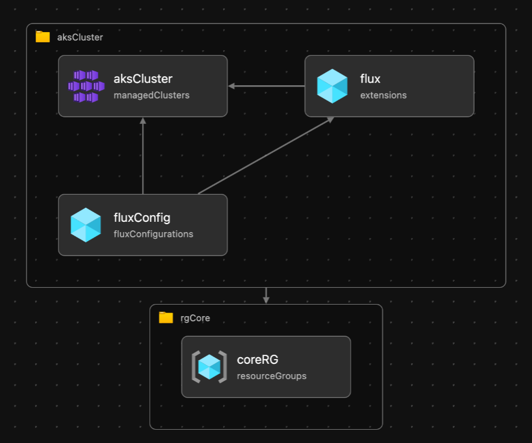

# aks-gitops-extension

This repository contains Bicep modules to deploy an basic Azure Kubernetes Service with the GitOps extension (microsoft.flux) enabled.



## Pre-Requisites

### General

- AKS with MSI (Manged Service Identity)

### Azure CLI

```bash
# Register the AKS-ExtensionManager preview features
az feature register -n Microsoft.ContainerService --name AKS-ExtensionManager
# Register provider for cluster extensions
az provider register -n Microsoft.Kubernetes
az provider register -n Microsoft.ContainerService
az provider register -n Microsoft.KubernetesConfiguration
# Monitor the registration process
az provider show -n Microsoft.Kubernetes -o table
az provider show -n Microsoft.KubernetesConfiguration -o table
az provider show -n Microsoft.ContainerService -o table
# Optional: Setup the Azure CLI extension for cluster extensions
az extension add -n k8s-configuration
az extension add -n k8s-extension
az extension list -o table
```

## Deploy

```bash
# What-if
az deployment sub what-if \
  --name AksBicepDeployment \
  --location westeurope \
  --template-file main.bicep
# Deploy
az deployment sub create \
  --name AksBicepDeployment \
  --location westeurope \
  --template-file main.bicep
```

## Useful commands for FluxCD

```bash
kubectl get fluxconfigs -A
kubectl get kustomizations -A
kubectl get gitrepositories -A
kubectl get helmreleases -A
kubectl get helmrepositories -A
```

## Useful docs

- [Tutorial: Use GitOps with Flux v2 in AKS](https://docs.microsoft.com/en-us/azure/azure-arc/kubernetes/tutorial-use-gitops-flux2)
- [Deploy and manage cluster extensions for AKS](https://docs.microsoft.com/en-us/azure/aks/cluster-extensions?tabs=azure-cli)
- [Cluster exensions - Overview](https://docs.microsoft.com/en-us/azure/azure-arc/kubernetes/conceptual-extensions)
- [GitOpns on Azure](https://docs.microsoft.com/en-us/azure/azure-arc/kubernetes/conceptual-gitops-flux2)
